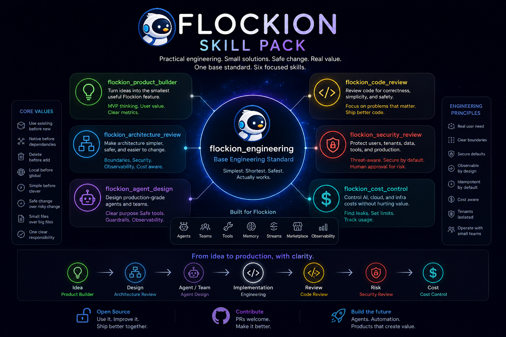

<p align="center">
  
</p>

<h1 align="center">Flockion AI Engineering</h1>

<p align="center"><strong><em>Lazy means efficient, not careless.</em></strong></p>

<p align="center">
  A family of <a href="https://claude.com/claude-code">Claude Code</a> skills that turn the model into a
  <strong>lazy senior engineer</strong> — one who writes the <em>least</em> code that safely solves the
  <em>real</em> problem, and refuses to build architecture for imaginary requirements.
</p>

<p align="center">
  <a href="./LICENSE"></a>
  <a href="#-the-skills"></a>
  <a href="#%EF%B8%8F-intensity-levels"></a>
</p>

---

## Why this exists

LLMs love to build. Ask for a cache and you get a `CacheManagerFactoryProvider`. Ask for a tab toggle and you get a global store. Ask for one endpoint and you get a hexagonal monolith.

Flockion is the antidote. It installs one belief into the model:

> The best code is code not written.
> The second-best code is boring, small, obvious, typed, tested where it matters, and easy to delete.

It is **never** lazy about understanding the task, root-cause analysis, security, validation, data safety, or your explicit requirements. It *is* lazy about boilerplate, fake abstractions, dependency bloat, and oversized files.

---

## 🪜 The Ladder

Every Flockion skill runs the same reflex before writing code. **Stop at the first rung that holds.**

```text
1. Does this need to exist at all?      → speculative? skip it, say so in one line
2. Does the codebase already have it?   → reuse the existing helper/type/service
3. Does the language / stdlib do it?    → use it before custom code
4. Does the native platform do it?      → browser / db / cloud / framework / OS
5. Does an installed dependency do it?  → don't add a new dep for a few lines
6. Can it be one line?                  → if it stays readable and correct
7. Only then write new code.            → the minimum that solves the real need
```

The ladder runs *after* it understands the problem, not instead of it: it reads the code the change touches and traces the real flow before picking a rung. Lazy about the solution, never about reading.

**Lazy, not negligent.** Trust-boundary validation, data-loss handling, security, and accessibility are never on the chopping block. The code ends up small because it is *necessary*, not golfed.

---

## 🧩 The Skills

Flockion works on **two layers**. The *lifecycle modes* pick the right mindset for the phase you're in; the *implementation flavors* decide how code actually gets written for a given stack. Every skill shares the same DNA — the Ladder, intensity levels, and three-line output style.

<p align="center">
  
</p>

### 🔁 Lifecycle modes — the Skill Pack

The phase-by-phase decision modes, catalogued in [`docs/skill-pack.md`](./docs/skill-pack.md). `engineering` is the base standard; the rest are sharper modes for a specific phase. Plugin invocation is `/flockion:<name>`.

| Phase | Skill | Use it to… |
| ----- | ----- | ----------- |
| 💡 Idea | **product-builder** | cut an idea down to the smallest shippable feature with a clear success metric |
| 📐 Design | **architecture-review** | make a design smaller, safer, and cheaper to change — not bigger |
| 🤖 Agents | **agent-design** | spec a trustworthy agent/team: narrow tools, contracts, guardrails, approval |
| 🛠️ Build | **engineering** | write the shortest safe code (the base coding standard) |
| 🔍 Review | **code-review** | catch what matters: correctness, security, data loss, bloat |
| 🛡️ Risk | **security-review** | block unsafe shortcuts before they reach production |
| 💸 Cost | **cost-control** | kill token/cloud cost leaks without hurting product value |

### ⚙️ Implementation flavors — stack-specific engineering

Specializations of the Build phase. Each takes the base standard and sharpens the Ladder and rules for its stack.

| Skill | Stack | File |
| ----- | ----- | ---- |
| **engineering-python** | Python · backend · APIs · serverless | [`skills/engineering-python/`](./skills/engineering-python/SKILL.md) |
| **engineering-react** | TypeScript · React · frontend · forms · state | [`skills/engineering-react/`](./skills/engineering-react/SKILL.md) |
| **engineering-infra** | DevOps · IaC · CI/CD · containers | [`skills/engineering-infra/`](./skills/engineering-infra/SKILL.md) |
| **engineering-data** | SQL · databases · migrations · pipelines | [`skills/engineering-data/`](./skills/engineering-data/SKILL.md) |
| **engineering-ai** | Agents · RAG · LLM · tool-calling · prompts | [`skills/engineering-ai/`](./skills/engineering-ai/SKILL.md) |

### 🗺️ How they fit together

```text
        ┌─ product-builder ──── what is the smallest useful feature?
 idea   │
        └─ architecture-review ─ what is the simplest safe design?
                     │
                     ├─ agent-design ─── (if it involves agents/teams)
                     ▼
 build   engineering ──────────── the base standard
                     │   specialized by stack ↓
                     ├─ engineering-python   (backend/apis)
                     ├─ engineering-react    (frontend)
                     ├─ engineering-infra    (devops/iac/ci-cd)
                     ├─ engineering-data     (sql/db/pipelines)
                     └─ engineering-ai       (llm/rag/agents)
                     ▼
 ship    code-review → security-review → cost-control
```

---

## 🎚️ Intensity Levels

Every skill supports three intensities. Default is **full**.

| Level | Behavior |
| ----- | -------- |
| `lite` | Build what was asked, but name the simpler alternative in one line. |
| `full` | Apply the Ladder strictly. Shortest safe diff. Short explanation only. |
| `ultra` | YAGNI extremist. Challenge the requirement. Prefer deletion before addition. |

```text
/flockion:engineering lite
/flockion:engineering full
/flockion:engineering ultra
```

Disable with: `stop flockion` · `normal mode`

---

## ⚡ What it looks like

**You:** *Add a cache for these API responses.*

**Flockion (full):**

```python
from functools import lru_cache

@lru_cache(maxsize=1000)
def fetch_config(key: str) -> Config:
    ...
```

…then three short lines, never an essay:

```text
skipped: custom cache class
add when: TTL, invalidation, or multi-instance consistency is required
```

**Flockion (ultra):**

```text
No cache until profiling shows this is slow. Then start with @lru_cache.
A custom TTL cache is a bug farm until proven necessary.
```

---

## 📊 What it optimizes for

The rule was never "fewest tokens." It is: **write only what the task needs, and never cut validation, error handling, security, or accessibility.** The code ends up small because it is necessary, not golfed. Lower diff size — and, on models that follow the ladder cleanly, lower cost and latency — are a *side effect* of stopping at the first rung that holds, not the goal.

The win is largest where there is a real over-build trap and near zero on code that is already minimal. These are **measured** code sizes of the minimal answer vs a representative hand-rolled one — run `npm run bench:loc` to reproduce them from [`benchmarks/reference/`](./benchmarks/reference):

| Trap | Naïve over-build | naive SLOC | Flockion | min SLOC |
| ---- | ---------------- | ---------- | -------- | -------- |
| Date input | a date-picker popover component | 135 | native `<input type="date">` | 21 |
| Color input | a hand-rolled HSV picker | 134 | native `<input type="color">` | 17 |
| Response cache | a `CacheManager` + TTL + eviction | 56 | `functools.lru_cache` | 5 |
| **Total** | | **325** | | **43** (**−87%**) |

> **Honesty note — what these numbers are and aren't.** The table above is real and reproducible, but it measures **code size**: a Flockion-minimal solution vs a representative hand-rolled one for each trap ([full method + limitations](./benchmarks/results/2026-06-23-loc-reference.md)). It is *not* proof the skill changes an agent's behavior. That claim needs the **agentic A/B study** — a real agent doing real work on a real repo, the same tickets **with and without** the skill, scored on the git diff it leaves behind (LOC, tokens, cost, time) plus a separate **adversarial safety tier**. That harness is scaffolded in [`benchmarks/`](./benchmarks) and is **not yet collected** — this README will not invent those numbers.

---

## 📦 Install

### Claude Code — plugin

The repo ships a Claude Code plugin manifest ([`.claude-plugin/`](./.claude-plugin/)), so you can install all the skills from the marketplace:

```text
/plugin marketplace add <your-org>/flockion
/plugin install flockion@flockion
```

(Replace `<your-org>/flockion` with the repo you host this in.)

### Claude Code — copy the skill files

The skills are plain Markdown — you can also just drop them in:

```bash
# Per-project (recommended for team-shared standards)
mkdir -p .claude/skills && cp -r skills/* .claude/skills/

# Global (every project) — macOS / Linux
mkdir -p ~/.claude/skills && cp -r skills/* ~/.claude/skills/
```

```powershell
# Global — Windows (PowerShell)
New-Item -ItemType Directory -Force $env:USERPROFILE\.claude\skills | Out-Null
Copy-Item -Recurse skills\* $env:USERPROFILE\.claude\skills\
```

Copied as personal skills, invoke by the folder name (`/engineering`, `/code-review`, …); installed as the plugin, they are namespaced (`/flockion:engineering`). Or just say **"flockion"**, **"be lazy"**, **"simplest solution"**, or **"YAGNI"** in any message.

### Other agents — always-on ruleset

For agents that read a project rules / instructions file, Flockion ships a compact always-on ruleset, generated from one source into each harness's format. Use the file your agent reads:

| Agent | File |
| ----- | ---- |
| Codex · OpenCode · Gemini · Zed · Aider (and most "AGENTS.md" readers) | [`AGENTS.md`](./AGENTS.md) |
| Cursor | [`.cursor/rules/flockion.mdc`](./.cursor/rules/flockion.mdc) |
| Windsurf | [`.windsurf/rules/flockion.md`](./.windsurf/rules/flockion.md) |
| Cline | [`.clinerules/flockion.md`](./.clinerules/flockion.md) |
| GitHub Copilot | [`.github/copilot-instructions.md`](./.github/copilot-instructions.md) |
| Kiro | [`.kiro/steering/flockion.md`](./.kiro/steering/flockion.md) |

Run Flockion from a checkout of this repo and these are picked up automatically; to use one elsewhere, copy it into the matching path in your project. All six are generated from [`rules/flockion.md`](./rules/flockion.md) — edit that one file and run `npm run build:adapters`. This always-on path carries the ruleset; the named `/flockion:*` skills above need a skill-capable host (Claude Code).

---

## 🧰 Commands & skills

In a skill-capable host (Claude Code), invoke a skill by name. Names below use the plugin form `/flockion:<name>`; a personal-skills copy drops the prefix (`/engineering`). The engineering skills take an optional intensity argument; the mode skills run at their default.

| Invoke | What it does |
| ------ | ------------ |
| `/flockion:engineering [lite\|full\|ultra]` | The base standard. Set the intensity, or run at the default (`full`). |
| `/flockion:engineering-python` · `-react` · `-infra` · `-data` · `-ai` | Stack-specialized engineering — same ladder, sharpened rules. |
| `/flockion:product-builder` | Cut an idea down to the smallest shippable feature with a clear success metric. |
| `/flockion:architecture-review` | Make a design smaller, safer, and cheaper to change. |
| `/flockion:agent-design` | Spec a trustworthy agent/team: narrow tools, contracts, guardrails, approval. |
| `/flockion:code-review` | Review the current diff for over-engineering — hands back a delete-list. |
| `/flockion:security-review` | Confirm the smaller diff never dropped a security or validation control. |
| `/flockion:cost-control` | Find token/cloud cost leaks without hurting product value. |

Intensity is per skill: **`lite`** names the simpler alternative, **`full`** (default) applies the ladder strictly, **`ultra`** is the YAGNI extremist for when the codebase has wronged you personally. Disable with `stop flockion` or `normal mode`.

---

## 🗣️ Trigger phrases

Flockion activates when you say any of:

> `flockion` · `be lazy` · `lazy mode` · `simplest solution` · `minimal solution` · `YAGNI` · `do less` · `shortest path` · `avoid overengineering` · `clean but simple`

…or when you complain about **bloat, boilerplate, unnecessary dependencies, oversized files, or architecture for imaginary requirements.**

---

## 🧱 Shared principles

Pulled directly from the skills, applied across the whole family:

- **Single Responsibility** — if the name needs "and", it does too much.
- **Simplicity before patterns** — no architecture cosplay.
- **No fake abstractions** — no interface with one implementation, no factory for one object.
- **Make invalid states impossible** — discriminated unions and typed models over loose dicts.
- **One source of truth** — a rule lives in exactly one place.
- **Side effects at the edges** — pure logic stays pure.
- **DRY, but late** — write it, notice it, *then* extract it. Wrong abstraction is worse than temporary duplication.
- **File Size Rule** — `100–300` good · `300–500` review · `500+` refactor · `800–1000` design warning.
- **Leave one small check** — non-trivial logic ships with its smallest useful test.

---

## 🛠️ Development

The skills are plain Markdown. The one build step keeps the harness adapters in sync:

```bash
npm run build:adapters   # regenerate AGENTS.md, .cursor, .windsurf, .clinerules, .github, .kiro
npm run check            # fail if any adapter drifted from rules/flockion.md  (also: npm test)
```

A few conventions keep the set coherent:

- **One source for the ruleset.** [`rules/flockion.md`](./rules/flockion.md) is canonical; the six harness adapters are generated from it. Edit the source, never the generated files — `npm run check` enforces it.
- **Skill layout.** Each skill is `skills/<name>/SKILL.md` (exactly one level deep — Claude Code does not recurse). The folder name is the invocation (`/flockion:<name>` as a plugin, `/<name>` as a personal skill). Frontmatter uses valid YAML: `name`, `description` (block scalar), `argument-hint`; `applyTo`/`license` are kept for the other adapters but ignored by Claude Code.
- **Keep the catalog in sync.** [`docs/skill-pack.md`](./docs/skill-pack.md) is the routing index — it points at the real skill files, it does not define skills. When you add or rename a skill, update the catalog and this README's tables.
- **One skill, one folder.** Each skill lives in its own folder under `skills/`. Don't merge skills back into a single doc.
- **Benchmarks are honest or absent.** See [`benchmarks/`](./benchmarks). Ship numbers only from real runs written up in `benchmarks/results/`; the example records are synthetic and labelled as such.
- **The file-size rule applies to skills too.** A skill that sprawls into a mega-standard is over-built — split it by responsibility, the same way the rules say to split code.

---

## 📄 License

[MIT](./LICENSE) © 2026 Igor Iric

---

> Build less. Delete more. Keep the code boring. Leave one small check where it matters.
